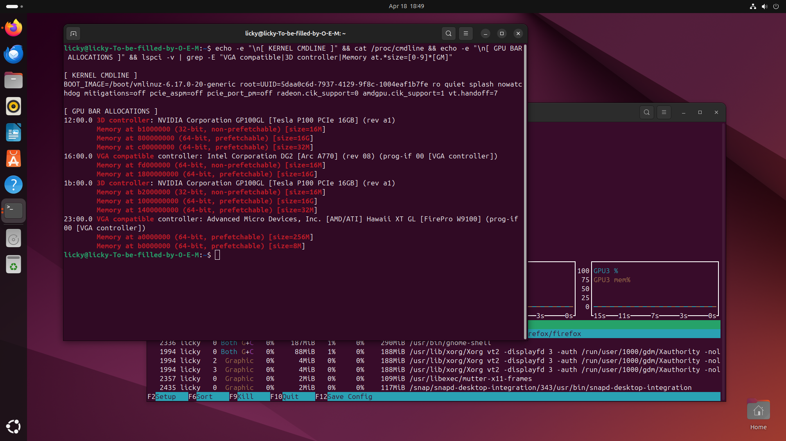
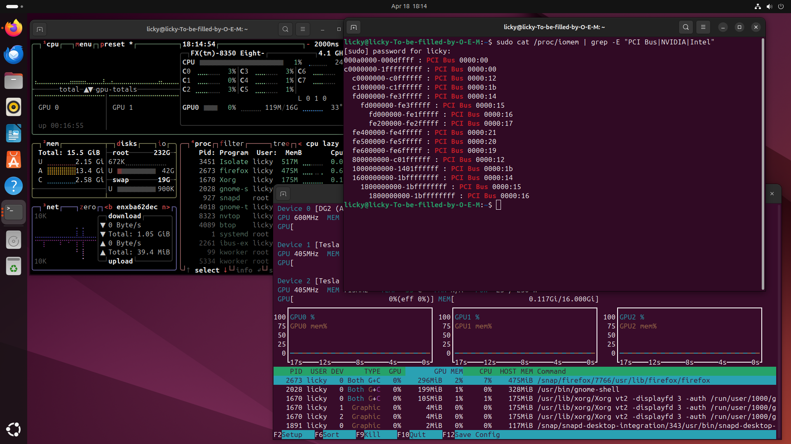
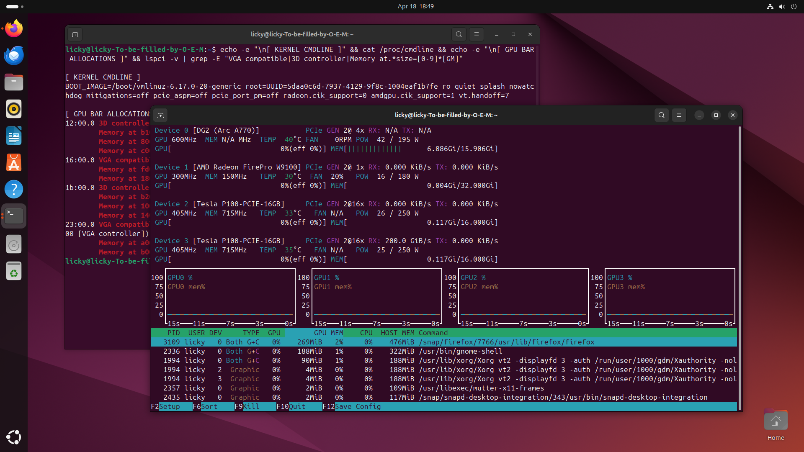
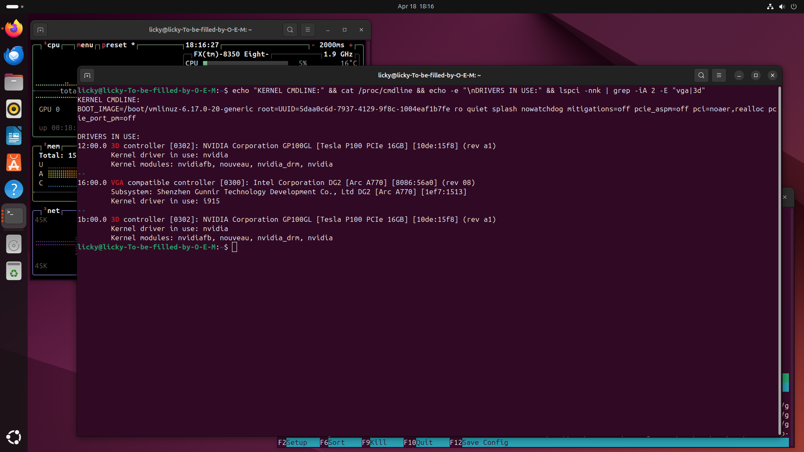

# 990fxOrchestrator

A UEFI DXE driver that enables **4g Deconding**,**Resizable BAR** and **MMIO64 placement** on
firmware and platforms that never supported *Above 4G Decoding* — specifically
the **Gigabyte GA-990FX-Gaming Rev 1.0** (AMD SR5690 + SP5100, AMI Aptio IV)
with AMD FX (Family 15h) CPUs, running the official **Rev 1.1 BIOS** as the
modification base.

This is a heavily extended fork of [xCuri0/ReBarUEFI][upstream]. See
[Dedication](#dedication--why-this-exists) below for why this project is
dedicated to that work.

[upstream]: https://github.com/xCuri0/ReBarUEFI

---

## What it does

On a bios designed in 2012 that knows nothing about 64-bit BARs or Resizable
BAR, this module boots GPUs that were designed for servers with terabytes of
MMIO64 space — four of them, simultaneously, each with **16 GB** of BAR,
without any kernel workaround (`pci=realloc`, `pci=nocrs`, etc.).

**Validated hardware stack:**

| Slot           | Device                                | BAR size | Location     |
|----------------|---------------------------------------|----------|--------------|
| PCIe x16 #1    | NVIDIA Tesla P100 (16 GB HBM2)        | 16 GB    | 0x800000000  |
| PCIe x16 #2    | NVIDIA Tesla P100 (16 GB HBM2)        | 16 GB    | 0x1000000000 |
| PCIe riser x1  | Intel Arc A770 (16 GB GDDR6)          | 16 GB    | 0x1800000000 |
| PCIe x4        | AMD FirePro W9170 (32 GB GDDR5)       | 16 GB    | 0x1C00000000 |

Bench result (post-flash, Linux 6.17, stock kernel): `lspci -vvv` shows four
64-bit prefetchable 16 GB regions above 4 GB, all devices bind their drivers
without errors, full LLM inference stacks (`llama.cpp` Vulkan, CUDA 13) run
clean.

### Validation screenshots

The four screenshots below are the smoking-gun evidence, captured on the
running box after flashing FTP39.F2 with `990fxOrchestrator` v9.5. They are
shipped in [`images/`](images) so anyone auditing the repo has the ground
truth without having to trust the text.

| Screenshot | What it proves |
|------------|----------------|
| [](images/dmesg_bar_allocations_4x16G.png) | `dmesg \| grep "GPU BAR ALLOCATIONS"` — every one of the four target GPUs reports `size=16G` from the kernel, without `pci=realloc`. This is the primary success criterion. |
| [](images/proc_iomem_mmio64_layout.png) | `/proc/iomem` filtered on PCI / NVIDIA / Intel — the regions land at `0x800000000`, `0x1000000000`, `0x1800000000`, `0x1C00000000`, exactly the map in [`docs/MMIO64_LAYOUT.md`](docs/MMIO64_LAYOUT.md). |
| [](images/nvtop_4gpu_detected.png) | `nvtop` with four GPUs simultaneously present and healthy (Intel Arc A770, AMD FirePro W9170, 2× NVIDIA Tesla P100). |
| [](images/lspci_drivers_bound.png) | `lspci -nnk` — `nvidia`, `i915` and `amdgpu` all bind their respective devices. No hung driver, no `IOMMU: device at boot` errors. |

Supporting evidence: [`images/dmesg_clean_boot.png`](images/dmesg_clean_boot.png)
(dmesg filtered on `WARN|error` — only MTRR / squashfs noise, zero PCIe
issues) and [`images/desktop_overview.png`](images/desktop_overview.png)
(full desktop with `lspci`, `btop` and `nvtop` visible at once).

*Source of the shots: my [WinRAID thread][winraid-thread] / linked Imgur
gallery. Reproduced here with the same author's consent (me).*

[winraid-thread]: https://winraid.level1techs.com/t/ga-990fx-gaming-rev-1-0-bios-with-native-4g-decoding-and-rebar/115893

**The module performs six things, in order, per boot:**

1. **DSDT patch** — flips `MALH` from `Zero` to `One` in the ACPI DSDT
   in-memory so the OS sees a valid 64-bit MMIO window descriptor.
2. **CPU NB MMIO window programming** — writes AMD FX Northbridge D18F1
   Window 1 registers to route a 256 GB range above 4 GB to the root bus.
3. **Pre-scan + PCIe Link Disable** — walks the bus, identifies devices
   whose full BAR size exceeds 4 GB, and disables the PCIe link on their
   upstream bridge so they vanish from the BIOS resource allocator (which
   cannot handle them correctly).
4. **GPU-specific BAR sizing and placement** — at ExitBootServices,
   re-enables links, programs the PCIe Resizable BAR capability on Arc A770
   and FirePro W9170 to 16 GB, and places every BAR at a deterministic,
   non-overlapping address above 4 GB.
5. **Bridge chain rewrite** — every PCIe bridge in the path to a resized
   endpoint gets its prefetchable base/limit/upper32 reprogrammed as a
   64-bit window of the correct size.
6. **Self-diagnostics** — every stage writes to three independent debug
   channels so a failed boot is *observable* without a JTAG rig: a
   complete per-stage trace to the NVRAM variable `ReBarBootLog`
   (readable after the next boot), POST codes to port 0x80 (visible on
   a two-digit LCD debug card) and a PC-speaker "module alive" beep
   melody at the end of the pipeline. See
   [`docs/DEBUG_CODES.md`](docs/DEBUG_CODES.md) for the full tag map.
   This is the feature that makes porting tractable — when a port
   fails, you know *which stage* failed.

See [`docs/ARCHITECTURE.md`](docs/ARCHITECTURE.md) for the full design and
[`docs/MMIO64_LAYOUT.md`](docs/MMIO64_LAYOUT.md) for the address map.

---

## Dedication — why this exists

Without [xCuri0's ReBarUEFI][upstream] this project would not exist. The
original module is what *showed that it was possible*: a DXE driver quietly
doing resource juggling at boot time, on firmware that never consented. It
flipped the switch in my head from "this board can't do it" to "if someone
else wrote a module for this problem, why can't I write one for mine?"

Over several months and nine major revisions the code was rewritten from
scratch — there is no line of xCuri0's original source in this repository
anymore. What remains, **intentionally**, is the `FILE_GUID` of the FFS
entry:

```
FILE_GUID = adf0508f-a992-4a0f-8b54-0291517c21aa
```

Keeping the original GUID has two purposes:

1. **A quiet tribute.** The module replaces the same slot in the BIOS image
   that his ReBarDxe would have occupied. That symmetry felt right to leave
   in place.
2. **Drop-in compatibility** with the same MMTool / UEFITool replace
   workflow that the upstream documentation describes.

**If the original author or any user finds the shared GUID problematic —
confusing, impolite, or just impractical because they want to run both
modules side by side — it can be regenerated with a single command and
nothing else in this codebase needs to change:**

```bash
uuidgen     # pick a fresh UUID, paste it into 990fxOrchestrator/990fxOrchestrator.inf
```

The GUID is not load-bearing. It is a souvenir, a reminder. If you believe that something is related just to the silicon, maybe you can be wrong. 

---

## This is not plug-and-play — and on any other board it is not even "plug"

> **Tested and verified on exactly one configuration: Gigabyte
> GA-990FX-Gaming Rev 1.0 running the official Rev 1.1 BIOS (FTP39.F2
> base, then patched with the set in [`bios-patches/`](bios-patches) and
> with the DSDT drop-in from [`dsdt/`](dsdt)), AMD FX-8350, with the
> four-GPU stack listed above.**
>
> On that exact machine the module is as close to plug-and-play as
> firmware work gets: flash, boot, read the log. On anything else —
> different motherboard, different BIOS revision, different CPU family,
> different GPU set, or even the same board without the accompanying
> static BIOS patches applied first — **the module is untested and will
> almost certainly not work out of the box**. "Untested" here does not
> mean "probably works with minor tweaks": it means the result is
> unknown and the failure mode may include a bricked board.
>
> **This is not a project for newcomers to BIOS modding.** To use it
> responsibly you need to be comfortable with: reading and patching a
> disassembled DSDT (even though a ready-made one is shipped, you still
> need to understand what it does), verifying that UEFIPatch patches
> apply at the intended GUIDs on your BIOS revision, using MMTool /
> UEFITool to swap FFS modules, and recovering a bricked SPI chip with
> a CH341A. If any one of those sentences is unfamiliar, stop and read
> the guides before touching a flasher.

### The module and the static BIOS patches are co-dependent — read this before anything else

**The runtime module does not *create* the 64-bit MMIO window.** It
*uses* a window that the static patches in [`bios-patches/`](bios-patches)
install into `PciRootBridge`, `PciBus`, `AmdAgesaDxeDriver` and
`AmiBoardInfo` — the 14 patches in Block 1 of `990fx.patches`,
binary-verified against the validated FTP39.F2 image (see that folder's
README for the methodology and the separate Block 2 of historical,
tested-but-not-present patches). Those patches are what teach the AMI
resource
allocator that a 64-bit prefetchable space above 4 GB *exists at all*.
Without them, the BIOS refuses to emit the 64-bit `QWordMemory`
descriptors the runtime needs to land BARs into; the module then boots,
logs its stages, and achieves nothing, because there is no MMIO64 space
for the OS to decode into.

**This combination has never been tested without the static patches.**
Every validated boot in this project has been with *both* layers
present. The expected failure mode if you flash the module alone (no
static patches) is "boots fine, lspci shows 256 MB BARs, module logs
say stage 4 completed but nothing decodes above 4 GB" — but this is an
educated guess, not a measurement.

Before flashing, verify that:

1. Every GUID in [`bios-patches/990fx.patches`](bios-patches/990fx.patches)
   exists in your BIOS image (UEFITool search by GUID). If any GUID is
   missing, the corresponding module is named differently in your
   revision and the patch will silently not apply.
2. UEFIPatch reports *every* pattern matched at its intended module.
   A "0 occurrences" report on any block means that block's byte
   pattern has drifted in your revision and you need to re-derive it
   by hand from Ghidra disassembly. Flashing a half-patched image is
   worse than flashing an unpatched one.
3. Your DSDT, after the `dsdt/AmiBoardInfo_ftp39.pe32.bin` drop-in,
   still contains exactly one `ALASKA` OEMID string and the byte
   sequence `FF FF FF FF 3F 00 00 00` (QWordMemory max = 256 GB). See
   [`dsdt/README.md`](dsdt/README.md) for the verification step.

### What is board-specific in the runtime module

Large parts of the module are **specific to one physical machine**:

- The DSDT patch offset targets the AMI Aptio IV DSDT shipped in Gigabyte's
  990FXG series BIOSes.
- The AMD FX Northbridge D18F1 Window 1 programming targets Family 15h
  chipsets (SR5690 / RD890 / RD990 / 990FX-class).
- The target MMIO64 addresses (`0x800000000`, `0x1000000000`,
  `0x1800000000`, `0x1C00000000`, `0x2000000000`) are fixed at compile time
  to match the exact GPU topology listed above.
- The PCIe bridge discovery routines know about the SB900 root port at bus
  `00:15.3` (function 3, not function 0 — a frequent pitfall), the SR5690
  GPP ports, and the intermediate Intel PCIe switch on the Arc A770 card.

Porting to another board or another GPU set requires:

1. Decompiling your DSDT and finding the equivalent of the `MALH` cap.
2. Confirming your Northbridge / IOMMU / IIO can be reprogrammed for an
   MMIO64 window and identifying the register interface.
3. Picking new target addresses that don't collide with what the BIOS
   already assigned to devices you *don't* resize.
4. Updating the discovery code for your bridge topology.
5. Re-deriving the static BIOS patches against your vendor's binaries —
   the hex patterns in `bios-patches/990fx.patches` were reverse-engineered
   from Gigabyte 990FX Aptio IV modules and will not apply as-is to a
   different vendor or even a significantly different AMI revision.

This is not hostile — it is the nature of sub-chipset firmware work. The
code is organized to make each of those changes localizable (placement
constants in a single block near the top of `990fxOrchestrator.c`, discovery
code parametric on VID:DID, the six-channel self-diagnostics described
above, etc.), and the docs in [`docs/`](docs) explain the reasoning
behind each choice. The detailed port guide — step by step, with a
worked example (swapping a W9170 for an RX 7900 XTX) — lives in
[`docs/CUSTOMIZATION.md`](docs/CUSTOMIZATION.md). The self-diagnostics
feature exists specifically so that a port attempt can be *debugged*
rather than guessed at: every stage logs what it saw and what it wrote,
so you can tell whether a port failed at the DSDT patch, the NB window
write, the pre-scan, the BAR resize, or the bridge rewrite.

### Support

Within the limits of a single-maintainer hobby project, I (the author)
will try to help if you land in an edge case I can recognize. The
highest-signal bug report includes: your board model and exact BIOS
revision, a stock-boot `lspci -vvv`, a module-boot `lspci -vvv`,
`/proc/iomem`, and the full `ReBarBootLog` NVRAM variable
(`DEBUG_CODES.md` has the copy-paste `dd` command). With those five
pieces I can usually tell, within one reading, whether the module saw
your hardware, what it tried to write, and what the bridge chain did
with those writes.

If you open an issue without that data, the honest answer I will have
to give is "I don't know". The diagnostics are built into the module
for exactly this reason — please use them.

---

## Disclaimer

**You can brick your motherboard with this.** Flashing a modified BIOS is a
hardware-destructive operation when it goes wrong. Before you flash anything:

- Own a hardware programmer — **CH341A + SOIC8 clip** is the standard
  recovery path, ~€15. See [`docs/RECOVERY.md`](docs/RECOVERY.md).
- Keep a known-good BIOS dump somewhere that is **not** on the machine
  being flashed.
- Read [`docs/FLASHING.md`](docs/FLASHING.md) fully. There is a specific
  pitfall (UEFIPatch output must not be flashed directly — use MMTool for
  module replacement) that has bitten multiple people on the WinRAID forum.
- After flashing, read [`docs/BIOS_SETUP.md`](docs/BIOS_SETUP.md) before
  changing any menu option. Several look relevant (CSM, HPCM, pci=realloc)
  and are actively harmful to this module's operation.

This project is provided under the MIT License (see [`LICENSE`](LICENSE)).
The license disclaims all warranties, including warranty of fitness for
purpose. **Use at your own risk.**

---

## Quickstart (build)

Prerequisites:

- Windows 10/11 with Visual Studio 2022 Build Tools or newer (`x64` MSVC
  toolchain).
- EDK2 source tree. A local copy is used by the build scripts in
  [`edk2/`](edk2).
- Python 3.x (for EDK2's `build.py`).

```powershell
# From repo root:
cd edk2
.\edksetup.bat
.\build_990fxo.bat
```

Build artifacts land in `edk2\Build\ReBarUEFI\RELEASE_VS2022\X64\`:

- `990fxOrchestrator.efi` — the raw PE32 driver.
- `990fxOrchestrator.ffs` — the FFS-wrapped version, ready for MMTool
  insertion into a BIOS image.

Verification markers in the built `.efi`:

| Marker (ASCII substring)        | Meaning                           |
|---------------------------------|-----------------------------------|
| `990fxOrchestrator v9.5 LOG`    | Top-of-log banner, identifies build |
| `ResizeIntelGpuBars v9.5 enter` | Intel BAR resize entry point      |
| `ResizeAmdGpuBars v9.4 enter`   | AMD BAR resize entry point        |
| `1002:67A0`                     | W9170 VID:DID match literal       |

See [`docs/DEBUG_CODES.md`](docs/DEBUG_CODES.md) for the full POST-port and
NVRAM log tag map.

---

## Flashing

See [`docs/FLASHING.md`](docs/FLASHING.md). Short version: open your BIOS
image in **MMTool 4.50.0.23** (*not* UEFITool's pad-file-aware replace, *not*
UEFIPatch), find the module by GUID `adf0508f-a992-4a0f-8b54-0291517c21aa`
or by name `990fxOrchestrator` (or the original `ReBarDxe` for a stock
upstream build), and **Replace** it with your freshly built `.ffs`. Save
the image and flash.

---

## Runtime behaviour

**Every boot, automatically, the module writes a complete trace to NVRAM.**
The variable `ReBarBootLog` (GUID `b00710c0-a992-4a0f-8b54-0291517c21aa`)
holds the last run's per-stage `[DA] … [DF]` log. It is overwritten at the
next boot; only the most recent boot is persisted. No toggle required —
this is always on.

```bash
# Linux:
sudo cat /sys/firmware/efi/efivars/ReBarBootLog-b00710c0-a992-4a0f-8b54-0291517c21aa \
  | strings
```

You should see the `v9.5 LOG` banner and the per-stage trace. See
[`docs/DEBUG_CODES.md`](docs/DEBUG_CODES.md) for the full tag reference,
POST port map and the audible beep-melody "module OK" confirmation.

`lspci -vvv` should show every target GPU with its BAR at the expected
address above 4 GB, and every intermediate bridge with a 64-bit prefetchable
window that contains that range.

---

## Project layout

```
ReBarUEFI-990FX/
├── README.md                 — this file
├── LICENSE                   — MIT (xCuri0 copyright + derivative attribution)
├── CHANGELOG.md              — v1 → v9.5 history
├── ACKNOWLEDGMENTS.md        — tools, specs, and people this project depended on
├── 990fxOrchestrator/
│   ├── 990fxOrchestrator.c   — the driver (single translation unit)
│   ├── 990fxOrchestrator.inf — EDK2 module manifest
│   └── 990fxOrchestrator.dsc — EDK2 platform description
├── edk2/
│   ├── build_990fxo.bat      — one-shot build script (VS2022)
│   └── gen_ffs_990fxo.bat    — rebuild .ffs without full EDK2 rebuild
├── dsdt/
│   ├── AmiBoardInfo_ftp39.pe32.bin — drop-in modified PE32 body for UEFITool Replace body
│   └── README.md             — FFS path + UEFITool step-by-step instructions
├── bios-patches/
│   ├── 990fx.patches         — UEFIPatch pattern file: Block 1 (applied in FTP39, verified) + Block 2 (historical, tested, not present)
│   └── README.md             — binary-verification methodology, workflow, safety notes
├── docs/
│   ├── ARCHITECTURE.md       — 5-stage pipeline, why each step
│   ├── MMIO64_LAYOUT.md      — the address map and why these addresses
│   ├── HARDWARE_NOTES.md     — board quirks (SB900 func 3, Hawaii, P100 tape mod, …)
│   ├── BIOS_SETUP.md         — what to toggle / not toggle after flashing
│   ├── CUSTOMIZATION.md      — porting to your own VID:DID / board
│   ├── FLASHING.md           — MMTool workflow, the UEFIPatch pitfall
│   ├── RECOVERY.md           — CH341A + SOIC8 recovery procedure
│   └── DEBUG_CODES.md        — POST port 0x80 map + NVRAM [Dx] log tags
└── images/
    ├── dmesg_bar_allocations_4x16G.png  — kernel log: 4× size=16G
    ├── proc_iomem_mmio64_layout.png     — /proc/iomem address map
    ├── nvtop_4gpu_detected.png          — four GPUs in nvtop
    ├── lspci_drivers_bound.png          — nvidia/i915/amdgpu all bound
    ├── dmesg_clean_boot.png             — dmesg WARN|error: clean
    └── desktop_overview.png             — ambient shot (lspci+btop+nvtop)
```

---

## Contributing

Pull requests are welcome, especially:

- Ports to other AM3+ / AM3 / 990FX / 890FX boards.
- Ports to other BIOS vendors where the same class of problem exists
  (old Aptio IV / Aptio V / AMI Core 8).
- Additional GPU VID:DID match rules for the discovery routines.

If your port produces a usefully different target-address table, please
submit it as a separate build configuration rather than changing the
defaults — the current constants are carefully chosen for the validated
hardware stack above and breaking them breaks the existing deployment.

---

## Attribution

Short list — the full credits, license notes and "software not used, and
why" are in [`ACKNOWLEDGMENTS.md`](ACKNOWLEDGMENTS.md).

- **Upstream project:** [xCuri0/ReBarUEFI][upstream] — the original module
  and the starting idea. MIT-licensed.
- **EDK2 / TianoCore:** the UEFI build system and base libraries,
  BSD-2-Clause.
- **Ghidra** (NSA) — reverse engineering AMI `PciBus`, `PciRootBridge`,
  `AmiBoardInfo`, AGESA.
- **UEFITool** — BIOS image exploration and module identification.
- **UEFIPatch** — static hex-patch research (not used for final flashing —
  see [`docs/FLASHING.md`](docs/FLASHING.md) for why).
- **MMTool 4.50.0.23** (AMI, proprietary) — the only trusted tool for
  replacing FFS modules inside AMI Aptio IV images without corrupting
  pad files.
- **AMIBCP 4.53 / 5.02** (AMI, proprietary) — BIOS menu option visibility
  editing.
- **WinRAID community:** for the reverse-engineering groundwork on AMI
  Aptio IV module layout, pad files, MMTool vs. UEFITool behaviour, and
  the general culture of "yes you can modify your own BIOS, here is how".

---

## License

MIT — see [`LICENSE`](LICENSE).
